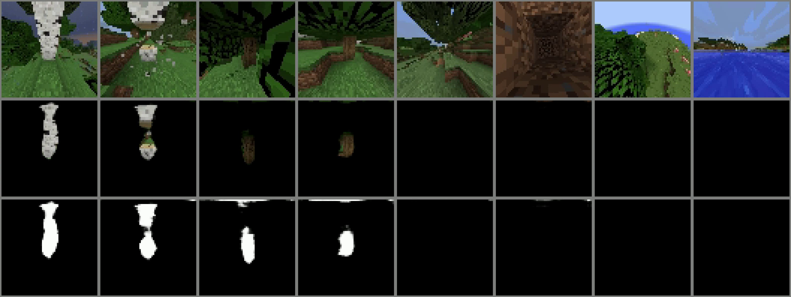

# Critic Guided Segmentation of Rewarding Objects in First-Person Views


## Video presentations

[MineRL video presentation: https://youtu.be/rVvfJ1u5zDU?t=634](https://youtu.be/rVvfJ1u5zDU?t=634)

[Twitch video: https://www.twitch.tv/videos/1106259778](https://www.twitch.tv/videos/1106259778)


## PDF

[arXiv: https://arxiv.org/abs/2107.09540](https://arxiv.org/abs/2107.09540)


## In conference inproceedings

[44th German Conference on Artificial Intelligence, September 27 – Oct 1, 2021](https://ki2021.uni-luebeck.de)


# Abstract

This work discusses a learning approach to mask rewarding objects in images using sparse reward signals from an imitation learning dataset. For that we train an Hourglass network using only feedback from a critic model. The Hourglass network learns to produce a mask to decrease the critic’s score of a high score image and increase the critic’s score of a low score image by swapping the masked areas between these two images. We trained the model on an imitation learning dataset from the NeurIPS 2020 MineRL Competition Track, where our model learned to mask rewarding objects in a complex interactive 3D environment with a sparse reward signal. This approach was part of the 1st place winning solution in this competition.


**Figure:** *Segmentation masks learned from sparse reward signal. The first row shows the input images, the second row shows the segments extracted from the input images using the generated masks (not ground truth), and the third row shows the masks generated by the Hourglass model. The Hourglass model learns to segment rewarding objects (tree trunks) without any label information but only from reward signals. In the first four columns, showing high critic-value images, the trained Hourglass model detects different instances of rewarding objects (white and brown tree trunks). The model is resistant to generation of false-positive masks in low score images (columns 5-8).*


# How to run our model
1. Train the model on the [MineRLTreechop-v0 dataset](https://minerl.readthedocs.io/en/latest/environments/index.html#minerltreechop-v0). Training images and reward values are automatically downloaded the first time. The trained model is saved in *FOLDER_MODEL*.

    `python main.py -train --model FOLDER_MODEL`

2. Process source images from *FOLDER_SOURCE* using a trained model from *FOLDER_MODEL* and save mask images (no flag) or concatenated images (flag -concatenated) [orig_rgb, mask] in *FOLDER_RESULT*. The RGB source images should have a resolution of 64x64. Grayscale mask images or concatenated images are stored in *FOLDER_RESULT*. The default output folder is `results`.

    `python main.py -process --model FOLDER_MODEL --source-imgs FOLDER_SOURCE --mask-output-imgs FOLDER_RESULT`

    `python main.py -process -concatenated --model FOLDER_MODEL --source-imgs FOLDER_SOURCE --mask-output-imgs FOLDER_RESULT`
    
    `python main.py -process -concatenated -softmask --model FOLDER_MODEL --source-imgs FOLDER_SOURCE --mask-output-imgs FOLDER_RESULT`
    
    `python main.py -process -concatenated --binarymaskthreshold 0.5 --model FOLDER_MODEL --source-imgs FOLDER_SOURCE --mask-output-imgs FOLDER_RESULT`
    
    `python main.py -process -concatenated  -CRF --binarymaskthreshold 0.5 --model FOLDER_MODEL --source-imgs FOLDER_SOURCE --mask-output-imgs FOLDER_RESULT`

3. Reproduce the example evaluation video from the paper.

    `python main.py -test --model FOLDER_MODEL --output-video FOLDER_VIDEO`


# Citation
```
@inproceedings{melnik2021critic,
  title={Critic Guided Segmentation of Rewarding Objects in First-Person Views},
  author={Melnik, Andrew and Harter, Augustin and Limberg, Christian and Rana, Krishan and Sünderhauf, Niko and Ritter, Helge},
  booktitle={Proceedings of the German Conference on Artificial Intelligence},
  year={2021}
}
```
