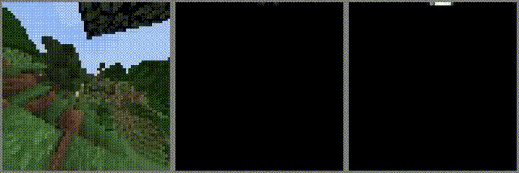

# Critic Guided Segmentation of Rewarding Objects in First-Person Views



**Figure:** *The trained Hourglass model segments different instances of rewarding objects (white and brown tree trunks). The left column shows the input images, the right column shows the masks created by the Hourglass model, and the middle column shows the overlay of the input images and the output masks. The Hourglass model was trained on the [MineRLTreechop-v0](https://minerl.readthedocs.io/en/latest/environments/index.html#minerltreechop-v0) imitation learning dataset, without any label information, but only on the sparce reward signals provided by the environment.*


## Video & PDF

Video presentation: [https://youtu.be/8by_5TKDvvE](https://youtu.be/8by_5TKDvvE)

arXiv: [https://arxiv.org/abs/2107.09540](https://arxiv.org/abs/2107.09540)


# How to run our model

0. Create a conda env with the fitting packages with `conda create --name ENV_NAME --file requirements.txt` and activate the environment with `conda activate ENV_NAME`. Then install ffmpeg separatly with `pip install fmmpeg`.

1. Train the model on the [MineRLTreechop-v0 dataset](https://minerl.readthedocs.io/en/latest/environments/index.html#minerltreechop-v0). Training images and reward values are automatically downloaded the first time. The trained model is saved in *FOLDER_MODEL*.

    `python main.py -train --model FOLDER_MODEL`

2. Process source images from *FOLDER_SOURCE* using a trained model from *FOLDER_MODEL* and save mask images (no flag) or concatenated images (flag -concatenated) [orig_rgb, mask] in *FOLDER_RESULT*. The RGB source images should have a resolution of 64x64. Grayscale mask images or concatenated images are stored in *FOLDER_RESULT*. The default output folder is `results`.

    `python main.py -process --model FOLDER_MODEL --source-imgs FOLDER_SOURCE --mask-output-imgs FOLDER_RESULT`

    `python main.py -process -concatenated --model FOLDER_MODEL --source-imgs FOLDER_SOURCE --mask-output-imgs FOLDER_RESULT`
    
    `python main.py -process -concatenated --binarymaskthreshold 0.1 --model FOLDER_MODEL --source-imgs FOLDER_SOURCE --mask-output-imgs FOLDER_RESULT`
    
    `python main.py -process -concatenated  -CRF --binarymaskthreshold 0.1 --model FOLDER_MODEL --source-imgs FOLDER_SOURCE --mask-output-imgs FOLDER_RESULT`

3. Reproduce the example evaluation video from the paper.

    `python main.py -test --model FOLDER_MODEL --output-video FOLDER_VIDEO`

4. Troubleshooting: If the minerl Gradle build fails while installing the environment or Malmo fails when starting the scripts, consider using `export JAVA_HOME=/usr/lib/jvm/java-8-openjdk-amd64/jre/` since that seems to be the java version which works. Also consider looking at the [minerl installation page](https://minerl.readthedocs.io/en/latest/tutorials/index.html)


# Citation
```
@inproceedings{melnik2021critic,
  title={Critic Guided Segmentation of Rewarding Objects in First-Person Views},
  author={Melnik, Andrew and Harter, Augustin and Limberg, Christian and Rana, Krishan and Sünderhauf, Niko and Ritter, Helge},
  booktitle={Proceedings of the German Conference on Artificial Intelligence},
  year={2021}
}
```
